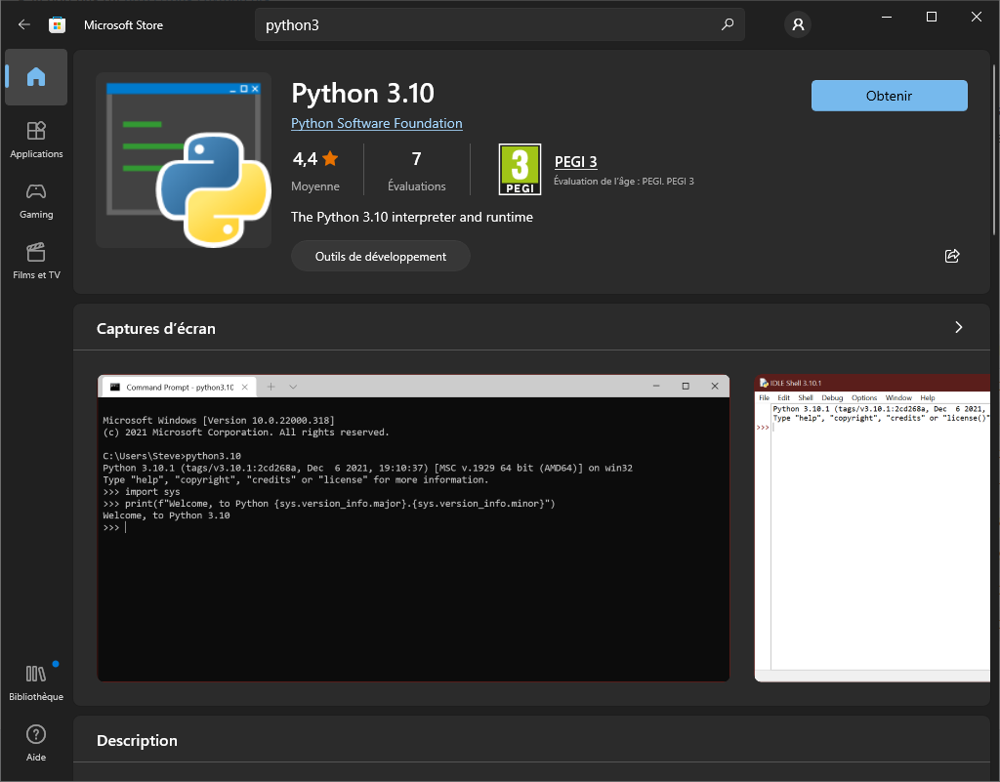

Dumb classes for test instrumentation access
============================================

Florian Dupeyron
October 2021-January 2022

Making this work on windows
---------------------------

Ah sh.t, here we go again...

1. Download some python distribution. You can use the windows store :



2. Install required packages

```
pip3 install -r requirements.txt
```

3. For USB-TMC devices, you need to install the ̀`WinUSB` driver. You can
   download the installer from https://github.com/pbatard/libwdi/releases/.
   Tested version is
   [2.7](https://github.com/pbatard/libwdi/releases/download/v1.4.1/zadig-2.7.exe).

   You should find your TMC devices in the combo box. If not, try to list all
   devices using ̀`Options -> List all devices`. Then, click the `Install Driver`
   or `Replace driver` button.

   

4. You should be able to launch using the python command line. For instance :

   ```
   python3.exe osccap.py IMG_NAME.png
   ```

5. In case you have a `No backend available` error, there is a dirty hotfix you can
   uncomment :

   ```python
   if sys.platform == "win32":
       import libusb
       
       # Uncomment this line if you get a "No backend availble" error
       # This line adds the found DLL_PATH to the PATH env. variable, so that
       # the libusb dll can be found by the current executable.
       os.environ["PATH"] = str((Path(libusb._platform.DLL_PATH) / "..").resolve()) + os.pathsep + os.environ["PATH"]
   ```

Example usage for the TDS2024B interface
----------------------------------------

```python

from instr.tds2024b import (
    TDS2024B_Interface,

    TDS2024B_Measurement_Source,
    TDS2024B_Measurement_Type,

    TDS2024B_Channel_Coupling,

    TDS2024B_Trigger_Type,
    TDS2024B_Trigger_Mode,
    TDS2024B_Trigger_Edge_Coupling,
    TDS2024B_Trigger_Edge_Slope,
    TDS2024B_Trigger_Edge_Source,
)

if __name__ == "__main__":
	osc = TDS2024B_Interface()

	# Set channel parameters
	def chan_conf(i):
		osc.ch[i].bw_filter = False                        # 200 MHz bandwidth
		osc.ch[i].scale     = 1.0                          # V/div
		osc.ch[i].coupling  = TDS2024B_Channel_Coupling.DC # DC coupling
		osc.ch[i].position  = 0                            # Center channel on scope

		osc.ch[i].settings_write()
		osc.ch[i].enable()

	def chan_hide(i):
		osc.ch[i].disable()

	chan_conf(0)
	chan_conf(1)
	chan_conf(2)
	chan_hide(3)

	# Set time trigger parameters
	osc.trigger.type          = TDS2024B_Trigger_Type.Edge
	osc.trigger.mode          = TDS2024B_Trigger_Mode.Auto
	osc.trigger.level         = 2.0 # V
	osc.trigger.edge_coupling = TDS2024B_Trigger_Edge_Coupling.DC
	osc.trigger.edge_slope    = TDS2024B_Trigger_Edge_Slope.Fall
	osc.trigger.source        = TDS2024B_Trigger_Edge_Source.CH1

	osc.trigger.settings_write()

	# Set horizontal time settings
	osc.horizontal_main.pos   = 0.0    # Center
	osc.horizontal_main.scale = 250e-6 # s

	osc.horizontal_main.settings_write()

	# Set immediate measurement settings
	osc.mes_imm.source         = TDS2024B_Measurement_Source.CH1
	osc.mes_imm.type           = TDS2024B_Measurement_Type.Period

	osc.mes_imm.settings_write()

	# Set measurement settings
	osc.mes[0].source         = TDS2024B_Measurement_Source.CH1
	osc.mes[0].type           = TDS2024B_Measurement_Type.NWidth # Negative pulse width
	osc.mes[1].source         = TDS2024B_Measurement_Source.CH2
	osc.mes[1].type           = TDS2024B_Measurement_Type.NWidth # Negative pulse width
	osc.mes[2].source         = TDS2024B_Measurement_Source.CH3
	osc.mes[2].type           = TDS2024B_Measurement_Type.NWidth # Negative pulse width

	osc.mes[0].settings_write()
	osc.mes[1].settings_write()
	osc.mes[2].settings_write()
```
